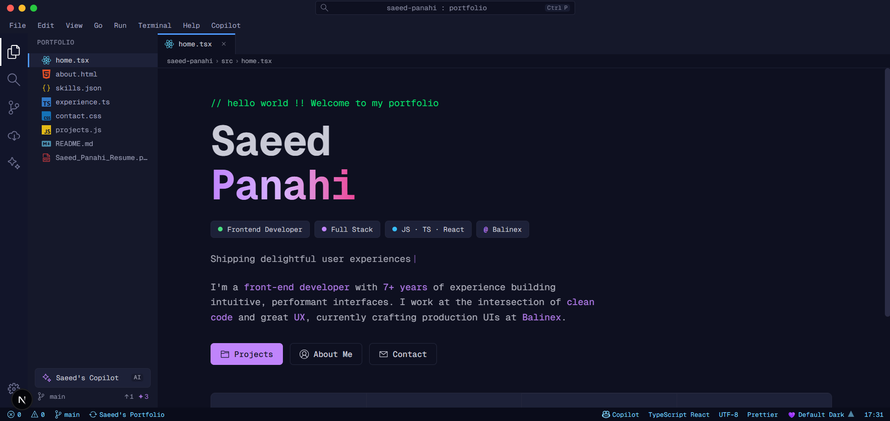

# Saeed Panahi — Portfolio

A personal portfolio for **Saeed Panahi**, styled as a **VS Code editor**: title bar, menu bar, activity bar, file-tree sidebar, editor tabs, status bar, a mock **Copilot** chat pane, a settings panel with live theme switching, and full **English / Farsi (RTL)** localization.



---

## Tech stack & rationale

| Tool                                   | Why                                                                        |
| -------------------------------------- | -------------------------------------------------------------------------- |
| **Next.js 16** (App Router, Turbopack) | File-based routing, RSC by default, fast dev/build.                        |
| **React 19**                           | Latest server/client component model.                                      |
| **TypeScript** (strict)                | Type-safe data contracts between the service layer and the UI.             |
| **Tailwind CSS v4** (CSS-first)        | Utility styling with theme tokens defined in CSS — no JS config.           |
| **next-intl v4**                       | Locale-prefixed routing (`/en`, `/fa`), server + client translations, RTL. |
| **framer-motion**                      | Pane slide-ins, drawer transitions, scroll-in skill bars.                  |
| **react-hook-form + zod**              | Typed, validated contact form.                                             |
| **zustand**                            | Available for future client state (not yet used).                          |
| **Jest + React Testing Library**       | Unit tests for chrome, theme, Copilot, pages, and services.                |

---

## Architecture

Feature-based and SOLID-leaning, with a clear seam between data and presentation.

- **Feature folders** (`src/features/<feature>/`) own their `components/`, `context/`, `hooks/`, `constants/`, and `types/`. Chrome lives in `features/layout`; theming/settings in `features/theme`; each page has its own feature folder.
- **Service layer** (`src/services/api/`) is the single source of page data. Pages call `get<Page>Data()` which today returns typed mock data; swapping to a real API is a one-file change per page (see below).
- **Server vs client**: pages and their `*View` components are **server components** (`async`, use `getTranslations`); interactive chrome and islands (Copilot, settings, typing tagline, skill bars, contact form) are **client components** (`"use client"`).
- **Single root layout**: `src/app/[locale]/layout.tsx` owns `<html>`/`<body>` and all providers. There is no `src/app/layout.tsx`; the proxy redirects `/` → `/en`.

### Folder structure

```
src/
├── app/[locale]/            # all routes (home, about, skills, experience, contact)
│   └── layout.tsx           # <html>/<body> + provider stack
├── proxy.ts                 # next-intl middleware (Next 16 renamed middleware.ts → proxy.ts)
├── features/
│   ├── layout/              # VS Code chrome: TitleBar, MenuBar, ActivityBar,
│   │   │                    #   SidebarPanel, TabsBar, StatusBar, MobileNav, CopilotPane
│   │   ├── context/         # TabsContext, CopilotContext
│   │   └── constants/       # pages.ts (PAGES, DECORATIVE_FILES)
│   ├── theme/               # ThemeContext, SettingsContext, SettingsPanel, themes
│   ├── home|about|skills|experience|contact/   # page views + types
├── services/api/            # <page>.service.ts + mock/<page>.mock.ts
├── shared/hooks/            # useTabs, useTypingEffect, useDirection
├── i18n/                    # routing.ts, request.ts, navigation.ts, locales/{en,fa}/*.json
├── styles/                  # globals.css + themes/*.css
└── test-utils/              # renderWithProviders, intl helpers
```

---

## Getting started

```bash
npm install
npm run dev          # dev server on http://localhost:3000
```

Other scripts:

```bash
npm run build        # production build (also the per-feature verification gate)
npm start            # serve the production build
npm run start:dev    # dev server on port 3001 (when 3000 is taken)
npm test             # Jest unit tests
npm run lint         # ESLint
npm run format       # Prettier --write
```

---

## How to…

### Add a page

1. Add an entry to `PAGES` in `src/features/layout/constants/pages.ts` (key, filename, href, icon, `navKey`).
2. Add `nav.<key>` to `src/i18n/locales/{en,fa}/common.json`.
3. Create the route `src/app/[locale]/<page>/page.tsx` (server component) that fetches data and renders a view.
4. Add the feature: `src/features/<page>/types/index.ts`, a `*View` component, and a service + mock under `src/services/api/`.

### Theme

Themes are pure CSS. Each lives in `src/styles/themes/<id>.css` scoped under `[data-theme="<id>"]`; `globals.css` re-exports tokens via `@theme inline { … }` so utilities like `bg-titlebar` work. Register a new theme in `src/features/theme/constants/themes.ts`. Switching writes `document.documentElement.dataset.theme` + `localStorage`; `ThemeInitScript` applies the persisted theme pre-hydration (no flash). **Do not add `tailwind.config.ts`.**

### Language

All visible strings come from `useTranslations` (client) / `getTranslations` (server) over the namespaces `common`, `home`, `about`, `skills`, `experience`, `contact` — each mirrored in `en/` and `fa/`. The settings panel switches locale via the localized `useRouter().replace(pathname, { locale })`. Use **logical CSS only** (`start`/`end`, `ms-*`, `ps-*`, `borderInlineStart`) so Farsi mirrors automatically; framer-motion `x` slides use the `useDirection()` hook to flip.

### Swap mock → real API

Each page reads from `src/services/api/<page>.service.ts`:

```ts
export async function getHomeData(): Promise<HomeData> {
  // TODO: Replace with real API call
  return homeMock;
}
```

Replace the body with a `fetch`/SDK call that returns the same typed shape (`HomeData`, `AboutData`, …). Nothing in the UI changes — the types are the contract.

---

## Testing

`npm test` runs Jest + React Testing Library (jsdom). `src/test-utils/render.tsx` provides `renderWithProviders` (NextIntl + Theme + Settings + Tabs + Copilot). Coverage spans layout chrome, theme/settings, the Copilot pane, page views, and the mock services.

---

## Deployment

Standard Next.js app — deploy to any Node host or Vercel. `npm run build` then `npm start`. The host's `PORT` is respected by `next start`. There are no required runtime env vars (data is mocked); add them when wiring a real API.
